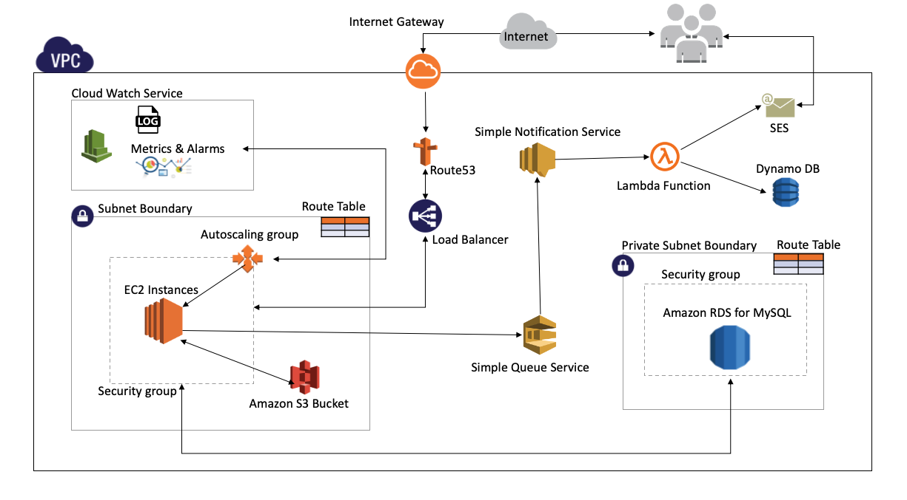
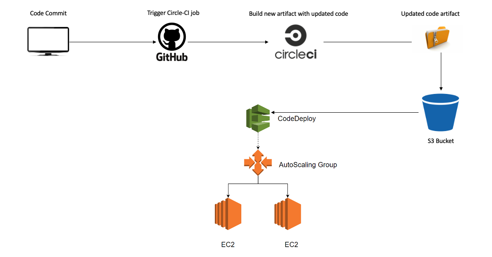
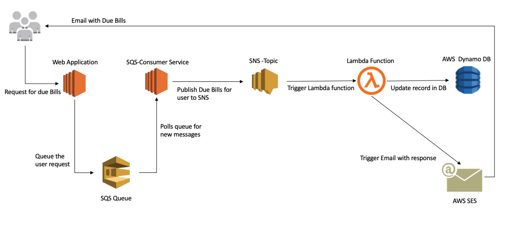

# AWSEC2-Deployment

## Deploying a web application on AWS-EC2

[Web Application Code Repository](https://github.com/Goutham1507/cloud-computing)

*Application Use Cases:*

* Application manages Billing invoices for the customer
* Users and Bills records are saved in MySQL RDS Instance
* Bill related files are uploaded to Amazon S3 bucket with lifecycle policy of 30 days
* Bill file metadata is stored in RDS Instance itself for retrieval purpose
* User receives his due bills in email via AWS Simple email service

*Tools and Technologies*

  <table>
    <thead>
      <tr>
        <th>Category</th>
        <th>AWS Services & Technologies</th>
      </tr>
    </thead>
    <tbody>
        <tr>
            <td>Web Application</td>
            <td>Java, MySQL, Hibernate ORM,Shell Scripts, AWS-SDK, ES6</td>
        </tr>
        <tr>
            <td>Infrastructure</td>
            <td>VPC, ELB, RDS, Lambda, DynamoDB, Route53, Cloud formation</td>
        </tr>
         <tr>
            <td>Metrics & Logging Service</td>
            <td>statsD, AWS Cloud-Watch, Log4js, Cloud-Watch Alarm </td>
        </tr>
         <tr>
            <td>Queue & Notification Mechanism</td>
            <td>SQS, SNS, Lambda, SES, </td>
        </tr>
          <tr>
            <td>CI/CD Pipeline</td>
            <td>Circle CI, AWS Code Deploy, AMI Automation</td>
        </tr>
       <tr>
            <td>Security</td>
            <td>SSL/TLS , RDS Encryption</td>
        </tr>
    </tbody>
  </table>
  

## Architecture Design

## Infrastructure - Cloud Formation 

[Cloud Formation Repository](https://github.com/Goutham1507/cloud-computing/tree/master/infrastructure)

* created custom VPC with network setup using cloud formation template
* Attached Load balancers, auto scaling groups, SES, SQS and SNS services
* Created necessary service roles and policies for AWS resources
* Implemented Lambda function for emailing service 

## CI/CD Pipeline - AMI - Hashicorp Packer

[HashiCorp Packer Code Repository](https://github.com/Goutham1507/cloud-computing/tree/master/ami)

* Automated AMI creation using Hashicorp packer
* Created AMI template to share the image between multiple AWS accounts
* Created golden images by adding provisioners to boostrap instances with - NPM, Code deploy and Cloud watch agaent

## CI/CD Pipeline - AWS Code Deployment

* Integrated Github repository with Circle-CI for continuous Integration
* Bootstrapped circle CI container with docker image to run the test cases and generate new code artifact
* Artifact is copied to S3 bucket and code deployement is triggered on running instances of autoscaling group
* In-Place deployment configuration hooks are placed for routing the traffic during deployment

## Logging & Alerting - Cloud Watch Services

* Embedded statD to collect various metrics such as counter for APIs hits and API response time etc
* logged the info, errors and warnings using log4js and further mounted them in AWS cloud-watch for analysis
* Implemented CPU Utilization based alarms for changing number of instances in auto scaling group

## Serverless Computing - Lambda 

[Serverless Lambda Code Repository](https://github.com/Goutham1507/cloud-computing/tree/master/serverless)

* Implemented pub/sub mechanism with SNS and Lambda function
* user requesting for his due bills, puts a message onto the AWS SQS service
* SQS-Consumer in the application checks already existing entry for user in Dynamodb
* If no email has sent already, SQS consumer process the request and puts the response in SNS 
* Once message is published to SNS Topic, subscribed lambda function is trigged 
* Lambda delivers due bills email to requesting user and saves the entry in Dynamo DB with TTL of 60 minutes

# webapp

*** Billing & Invoicing System ***

API Impementation with `Spring Boot`
Programming language : `Java`

External Libraries used:
1. UUID - for generating id fields
2. Bcrypt - for hashing out the passwords
3. basic-auth - Authentication module 
4. Hibernate - ORM for Java
5. mysql - dialect for hibernate
6. mockito - for integration testing in java

_Build & Deployment_
The application runs on AWS Cloud EC2 instance and is deployed via CircleCI pipe-line.
As sson as there is a merge take place to the webapp repository, the build gets triggered and deployment takes place in AWS account.

Environemnt variables need to be configured in CircleCI pipeline are

1. AWS_SECRET_KEY 
2. AWS_ACCESS_KEY
3. CODE_DEPLOY_BUCKET
4. AWS_REGION

*Command to import the SSL certificate for LoadBalancers*
`sudo aws acm import-certificate --certificate fileb://certificate.pem --certificate-chain fileb://certificate_chain.pem --private-key fileb://mysslcertificate.key --profile prod`

*Run the appication locally*
=========================================

Steps
1. Clone the repos locally 
2. Install maven dependenices using 'mvn clean install -Plocal'
3. Run the application using following command 'java -Dspring.profiles.active=$springprofilesactive -Ddb.url=$dburl -Ddb.username=$springdatasourceusername -Ddb.password=$springdatasourcepassword -Dbucket.name=$bucketname -jar demo-0.0.1-SNAPSHOT.war'
4. Test whether appliation is running or not at (http://localhost:8080/)

*Run the unit test cases*
`mvn test`

`Author: V.Goutham Reddy`  
`Email: valagolam.g@northeastern.edu`